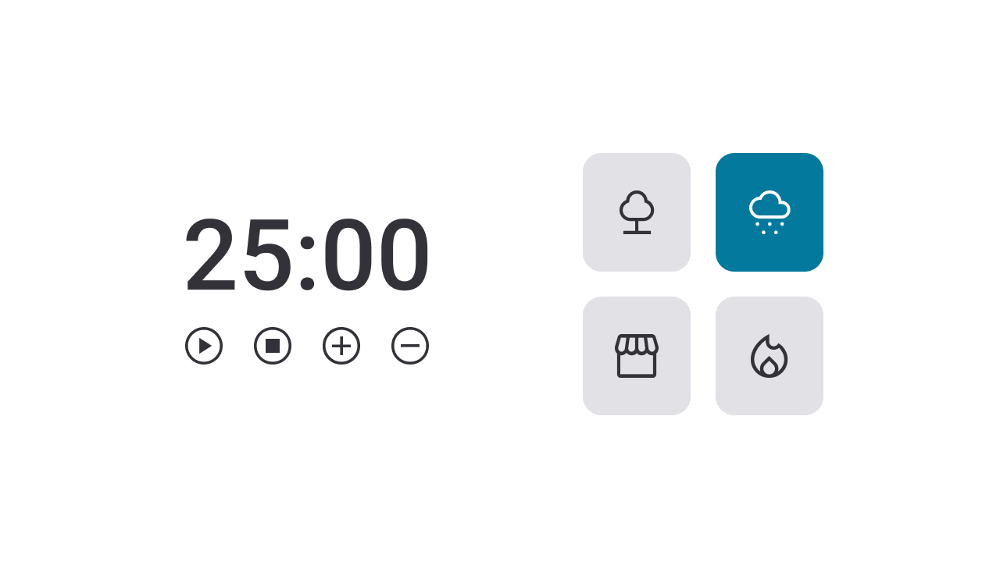

# DESAFIO-TIMER
<strong><h1 align="center">Focus timer 2.0</h1></strong>

  

## Objetivo
O objetivo desse projeto foi criar um timer/alarme para que o usuário utiliza-se o para fins de estudo e conseguir medir as pausas com exatidão. Para ficar ainda mais interessante ao usuário implementamos alguns sons que podem ser escolhidos dependendo do foco e humor.

## 🚀 Tecnologias

Esse projeto foi desenvolvido com as seguintes tecnologias:

- HTML
- CSS
- JAVASCRIPT

---

Feito com ♥ by [Rocketseat](https://rocketseat.com.br)
